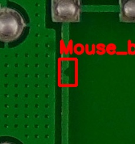
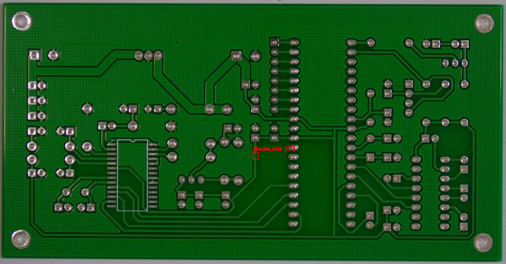
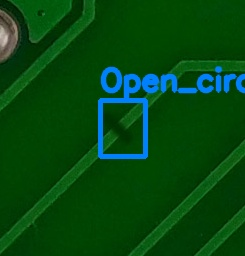
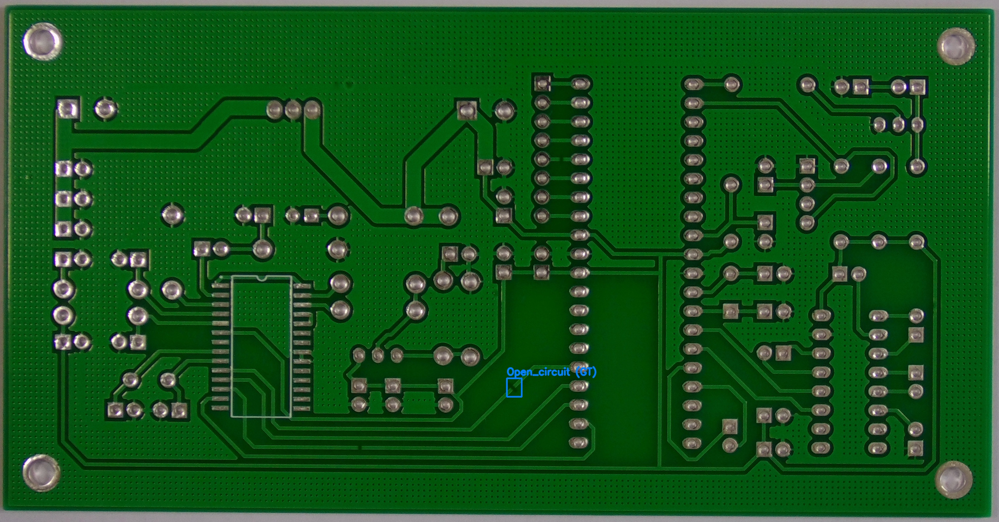
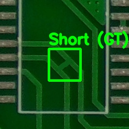
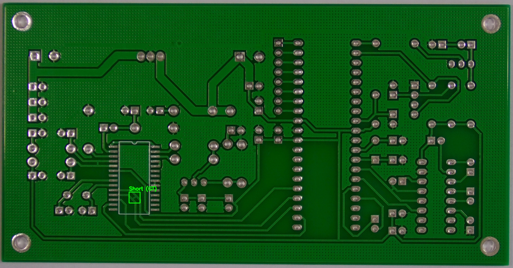
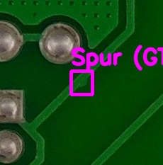
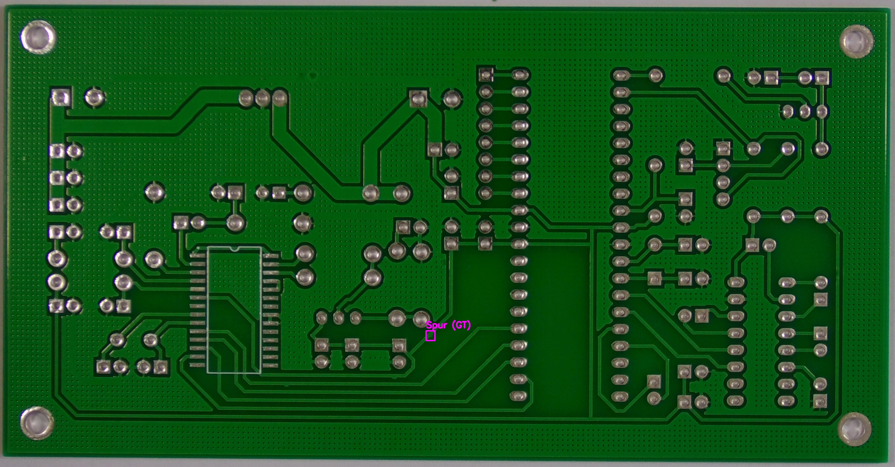
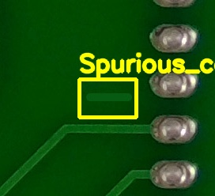
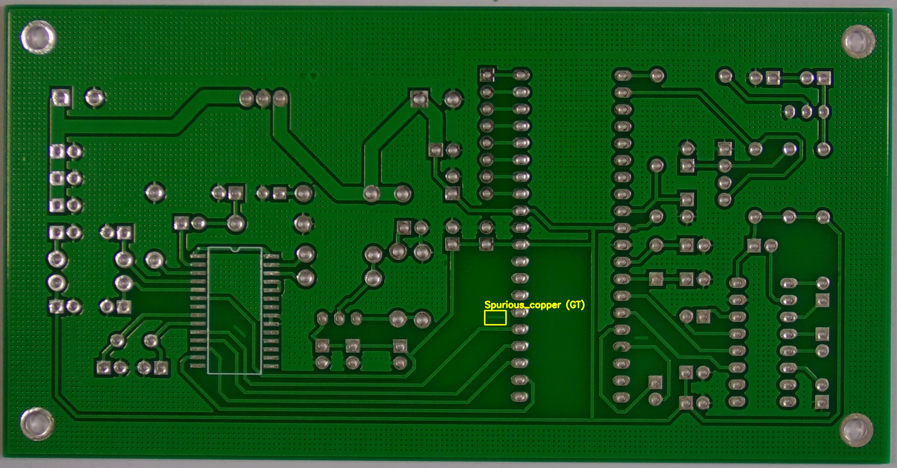

# PCB表面缺陷检测项目 (YOLOv8)

基于 YOLOv8 目标检测算法，对 PCB 表面缺陷的定位与分类识别。

---

## 项目目录结构

```text
机器学习和深度学习/
├── 训练集-PCB_DATASET/     # 原始训练集：包含图像与 Pascal VOC (XML) 标注
├── PCB_瑕疵测试集/         # 测试样例集：包含按类别存放的测试图与 YOLO 标签
├── pcb_defects_assets/     # 缺陷图例（局部与全图）
├── scripts/                # 功能脚本
│   ├── prepare_dataset.py   # 数据准备与划分
│   ├── train_yolo.py       # 模型训练
│   ├── evaluate_yolo.py    # 离线评测
│   └── visualize_detections.py # 真值与预测值对比可视化
└── outputs/                # 运行输出目录（清洗后数据集、评估结果、可视化图像）
```

---

## PCB 缺陷图例

### 1. 鼠咬（Mouse bite）

* **特征**：铜导线边缘铺铜缺失了一块，呈现半圆形或不规则凹坑。

|                         局部细节                         |                         全板定位                         |
| :-------------------------------------------------------: | :-------------------------------------------------------: |
|  |  |

---

### 2. 开路（Open circuit）

* **特征**：铜导线在中间出现物理缝隙或断口。

|                          局部细节                          |                          全板定位                          |
| :---------------------------------------------------------: | :---------------------------------------------------------: |
|  |  |

---

### 3. 短路（Short）

* **特征**：相邻两根导线被多余的铜皮粘连或桥接。

|                       局部细节                       |                       全板定位                       |
| :--------------------------------------------------: | :--------------------------------------------------: |
|  |  |

---

### 4. 残铜/刺（Spur）

* **特征**：导线边缘凸起、多出了一小块不规则的尖刺残铜。

|                       局部细节                       |                       全板定位                       |
| :---------------------------------------------------: | :---------------------------------------------------: |
|  |  |

---

### 5. 多铜（Spurious copper）

* **特征**：在绝缘空白区散落了孤立的无规则铜皮块。

|                            局部细节                            |                            全板定位                            |
| :------------------------------------------------------------: | :------------------------------------------------------------: |
|  |  |

---

## 快速开始与工作流

按顺序运行以下脚本：

### 1. 数据准备

完成 XML 坐标转换与数据集划分：

```bash
python scripts/prepare_dataset.py
```

生成的数据保存在 `outputs/pcb_yolo_dataset/`。

### 2. 模型训练

```bash
python scripts/train_yolo.py
```

### 3. 模型评测

计算每类 AP 和 mAP@0.5：

```bash
python scripts/evaluate_yolo.py
```

结果保存在 `outputs/eval/`。

### 4. 结果可视化

将真值与预测值对比可视化：

```bash
python scripts/visualize_detections.py
```

结果保存在 `outputs/visualizations/`。
